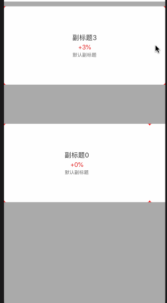

# YJCycleCollectionView
collection view的小组件, 按照item进行翻页，具有属性的配置功能和无限循环  

因工作需要,做一个具有无限循环并且按照item进行翻页的CollectionView组件。

那么问题来了，如何去做呢？

##### 先尝试去做翻页功能

* 先进行系统UICollectionView的测试，



由上图，我们可以很明显的发现，系统原始的翻页功能无法达到我们的效果！

我们也知道，系统的collectionView翻页机制是根据当前collectionView的宽度来决定，也就是说，当item的 宽度刚好等于collectionView的宽度时，系统翻页效果是正常的，否则会出现翻页到item中间的情况！

* 接下来就是自定义，我尝试做了一下，如图


这里的翻页如何实现的？

首先在组件中记录item的size，然后在scrollview代理中获取到拖拽结束和自由滚动结束的状态，当动画彻底结束时进行位置校对,

校正代码如图

```swift
public func scrollViewDidEndScrollingAnimation(_ scrollView: UIScrollView) {
        
        guard let collectionView = scrollView as? UICollectionView else { return }
        let count = originItemsCount
        /// 分页修正
        if isPagingEnabled {
            let itemIndex = currentIndex()
            var point = collectionView.contentOffset
            
            let maxX = scrollView.contentSize.width - scrollView.frame.width
            let maxY = scrollView.contentSize.height - scrollView.frame.height
            /// 添加min 优化最后一个不符合分页的问题
            switch scrollDirection {
            case .horizontal:
        
                let X = min(maxX, (realItemSize.width + minimumLineSpacing) * CGFloat(itemIndex))
                
                point = CGPoint(x: X, y: point.y)
            default:
                
                let Y = min(maxY, (realItemSize.height + minimumLineSpacing) * CGFloat(itemIndex))
                point = CGPoint(x: point.x, y: Y)
            }
            collectionView.setContentOffset(point, animated: true)
            /// 判断用于修正修正过程中再次触发动画引起的重复调用问题 排除零点和最后一个格时的非对齐状态
            if scrollView.contentOffset != point ||
                (point.x == 0 && point.y == 0) ||
                (point.x == maxX && maxX > 0) ||
                (point.y == maxY && maxY > 0) {
                didScrollItemOperationBlock?(itemIndex % originItemsCount, nil)
            }
            
        }
}
```

那如何判定拖拽结束和自由滚动结束呢？而且要保证位置校对不执行多次

代码如图

```swift
/// 是否有速度,用于判定何时结束
fileprivate var rate : Bool = false
public func scrollViewWillEndDragging(_ scrollView: UIScrollView, withVelocity velocity: CGPoint, targetContentOffset: UnsafeMutablePointer<CGPoint>) {
        // velocity.y表示在将要离开拖动的时候的方向（-，+），速率；y==0就是没有速率的拖动
        /// 获取当前速率
        var currentRate = velocity.x
        if scrollDirection == .vertical {
            currentRate = velocity.y
        }
        self.rate = (currentRate > 0 || currentRate < 0)
    }
    
    public func scrollViewDidEndDragging(_ scrollView: UIScrollView, willDecelerate decelerate: Bool) {
        //decelerate 表示在手指离开拖动的时候是否有速度
        if self.rate == false && decelerate == false {
            scrollViewDidEndScrollingAnimation(collectionView)
        }
    }
    
    public func scrollViewDidEndDecelerating(_ scrollView: UIScrollView) {
        if self.rate == true {
            scrollViewDidEndScrollingAnimation(collectionView)
        }
    }
```

##### 翻页功能已具备，接下来就是无限循环功能

这里我有两种想法

第一种想法：总共生成n+2个item，第一个放置最后一个item，最后一个放置第一个item，初始展示偏移1个单位，当滑动进入最后一个或者第一个时，进行偏移量切换，以达到循环的目的。

但该想法有一个比较致命的缺陷，当快速滑动时可能会出现滑到边际的问题，UI效果不理想。

第二种想法：我们知道，系统的collectionView本身对cell做了缓存池，做了性能优化。无论item的数量有多少，collectionView的内存使用是有限的。

那么就基于该理论来进行实现。

如何做呢？

我参照了SDCycleScrollView的实现，初始化时生成200 * N个item，然后在layoutsubviews方法中切换到 (200 * N)/2的位置。

当滑动时对当前的偏移位置根据条件进行校对，防止滑动到最开始或者最末尾的位置，出现边际的问题。

我这里给了默认条件，总数量的10%，也就是滑动到 (200 * N)*10% 前后，将偏移位置无动画改为初始化时的位置

代码如下,这里考虑了横向和纵向的情况

```swift
/// 无限循环进行位置修正
    func fixInfiniteLoopLocation() {
        let count = originItemsCount
        if isInfiniteLoop {
            let itemIndex = currentIndex()
            let tempfixScale = min(max(fixScale, 0), 1)
            if tempfixScale == 0 { return }
            
            var position = UICollectionView.ScrollPosition.left
            var isNeedFix = false
            var width : CGFloat = 0
            var height : CGFloat = 0
            switch scrollDirection {
            case .horizontal:
                position = .left
                width = realItemSize.width + self.minimumLineSpacing
                isNeedFix = collectionView.contentOffset.x < collectionView.contentSize.width * tempfixScale || collectionView.contentOffset.x > collectionView.contentSize.width * (1 - tempfixScale)
            default:
                position = .top
                height = realItemSize.height + self.minimumLineSpacing
                isNeedFix = collectionView.contentOffset.y < collectionView.contentSize.height * tempfixScale || collectionView.contentOffset.y > collectionView.contentSize.height * (1 - tempfixScale)
            }
            
            if isNeedFix {
                DispatchQueue.main.asyncAfter(deadline: DispatchTime.now()+0.2) {
                    
                    if self.isPagingEnabled {
                        let targetIndex : Float = Float(self.totalItemsCount) * 0.5 + Float(itemIndex % count)
                        self.collectionView.scrollToItem(at: IndexPath(item: Int(targetIndex), section: 0), at: position, animated: false)
                    } else {
                        var point = self.collectionView.contentOffset
                        if width > 0 {
                            let X = CGFloat(self.totalItemsCount/2) * width + self.collectionView.contentOffset.x.truncatingRemainder(dividingBy: width * CGFloat(count))
                            point = CGPoint(x: X, y: point.y)
                        } else if height > 0 {
                            let Y = CGFloat(self.totalItemsCount/2) * height + self.collectionView.contentOffset.y.truncatingRemainder(dividingBy: height * CGFloat(count))
                            point = CGPoint(x: point.x, y: Y)
                        }
                        self.collectionView.setContentOffset(point, animated: false)
                    }
                }
            }
        }
    }
```

然后提交，我还以为要收工了呢，结果反馈UI效果太丝滑，和系统的那种分页效果不同，继续改！

##### 翻页功能继续修改

思考一下，如何做到系统的那种操作感觉呢？那就是使用系统的方式，但是要对翻页的宽度做调整，百度 Google了解一下，搜索 如何修改collectionView的翻页宽度？ 然后就找到了，自定义flowlayout,在这里自行计算偏移

注意：这里需要将collectionView的系统翻页效果关闭，否则下面的代码是无效！很不幸，我掉下去了^-^ ^-^ ~~

代码如下

```swift 
class YJCycleCollectionViewFlowLayout: UICollectionViewFlowLayout {
    /// 规定超过这个滚动速度就强制翻页，从而使翻页更容易触发。默认为 0.4
    var flickVelocity: CGFloat = 0.4
    override func targetContentOffset(forProposedContentOffset proposedContentOffset: CGPoint, withScrollingVelocity velocity: CGPoint) -> CGPoint {
        
        guard let collectionView = collectionView, let view = collectionView.delegate as? YJCycleCollectionView else { return super.targetContentOffset(forProposedContentOffset: proposedContentOffset, withScrollingVelocity: velocity) }
        
        let currentItemSize = view.collectionView(collectionView, layout: self, sizeForItemAt: IndexPath(item: 0, section: 0))
        let currentMinimumLineSpacing = view.collectionView(collectionView, layout: self, minimumLineSpacingForSectionAt: 0)
        
        
        let pageWidth: CGFloat = currentItemSize.width + currentMinimumLineSpacing
        
        let pageHeight : CGFloat = currentItemSize.height  + currentMinimumLineSpacing
        
        switch scrollDirection {
        case .horizontal:
            return page(width: pageWidth, velocity: velocity, collectionView: collectionView, proposedContentOffset: proposedContentOffset)
        default:
            return page(height: pageHeight, velocity: velocity, collectionView: collectionView, proposedContentOffset: proposedContentOffset)
        }
    }
    
    /// 获取横向要偏移的位置
    func page(width : CGFloat, velocity: CGPoint, collectionView: UICollectionView, proposedContentOffset: CGPoint) -> CGPoint {
        let rawPageValue = collectionView.contentOffset.x / width
        let currentPage = velocity.x > 0 ? floor(rawPageValue) : ceil(rawPageValue)
        let nextPage = velocity.x > 0 ? ceil(rawPageValue) : floor(rawPageValue)
        let pannedLessThanAPage = abs(1 + currentPage - rawPageValue) > 0.5
        
        let flicked = abs(velocity.x) > flickVelocity
        
        var offset = proposedContentOffset
        
        if pannedLessThanAPage && flicked {
            offset.x = nextPage * width
        } else {
            offset.x = round(rawPageValue) * width
        }
        return offset
    }
    
    /// 获取纵向要偏移的位置
    func page(height : CGFloat, velocity: CGPoint, collectionView: UICollectionView, proposedContentOffset: CGPoint) -> CGPoint {
        let rawPageValue = collectionView.contentOffset.y / height
        let currentPage = velocity.y > 0 ? floor(rawPageValue) : ceil(rawPageValue)
        let nextPage = velocity.y > 0 ? ceil(rawPageValue) : floor(rawPageValue)
        let pannedLessThanAPage = abs(1 + currentPage - rawPageValue) > 0.5
        let flicked = abs(velocity.y) > flickVelocity
        
        var offset = proposedContentOffset
        
        if pannedLessThanAPage && flicked {
            offset.y = nextPage * height
        } else {
            offset.y = round(rawPageValue) * height
        }
        return offset
    }
}
```

测试代码及完整组件见demo，效果还可以，收工！


##### 2020-08 添加定时循环功能，添加倾向于OC的兼容处理